<p align="center">
  
</p>

<h1 align="center">TRENDB: IT 트렌드 분석 AI 에이전트 Server</h1>
<p align="center">다양한 도구를 활용하여 IT 업계 트렌드에 대한 인사이트를 제공하는 지능형 에이전트</p>
<p align="center"><strong>Spring Boot 기반 인증, 협업, 대시보드, AI 연동 허브</strong></p>
<p align="center"><strong>프로젝트 기간: 2024.07.10 ~ 2025.06.04</strong></p>

<p align="center">
  <a href="https://www.java.com/"></a>
  <a href="https://spring.io/projects/spring-boot"></a>
  <a href="https://spring.io/projects/spring-security"></a>
  <a href="https://spring.io/projects/spring-data-jpa"></a>
  <a href="https://www.postgresql.org/"></a>
  <a href="https://www.elastic.co/elasticsearch"></a>
  <a href="https://aws.amazon.com/s3/"></a>
</p>

<p align="center">
  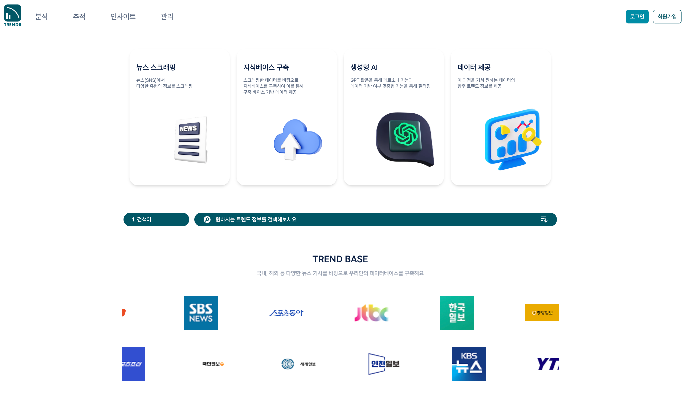
  <br>
  <em>TRENDB 메인 화면</em>
</p>

## 1. 프로젝트 소개

### 개발 목적
급변하는 기술 환경 속에서 실시간으로 쏟아지는 방대한 정보들을 한눈에 파악하고, 비즈니스 변화에 신속하게 대응하는 것은 모든 기업의 중요한 과제입니다. **TRENDB**는 이러한 필요성에 따라 임직원들이 최신 IT 트렌드를 놓치지 않고, 데이터에 기반하여 올바른 방향성을 설정할 수 있도록 지원하기 위해 개발되었습니다.

**TRENDB**는 기존 거대 언어 모델(LLM)의 한계인 환각 현상을 줄이고, 신뢰할 수 있는 최신 정보를 제공하는 것을 핵심 목표로 삼습니다. 이를 위해 데이터 수집 파이프라인, AI 에이전트 서버, 메인 API 서버를 분리한 구조로 서비스 전반을 설계했습니다.

이 중 `server` 레포는 Spring Boot 기반의 메인 애플리케이션 서버로서, 사용자의 인증과 권한 관리부터 팀 협업, 파일 공유, 인사이트 대시보드 데이터 제공, 그리고 FastAPI 기반 AI 에이전트 서버와의 연동까지 담당합니다.

사용자는 이 서버를 통해 하나의 서비스 안에서 다음 흐름을 자연스럽게 이어갈 수 있습니다.

- 회원가입과 로그인 후 개인 및 팀 단위로 서비스 이용
- 국내외 뉴스 인사이트 대시보드 탐색
- AI 챗봇과의 스트리밍 대화 및 페르소나 선택
- 팀 문서 업로드, 공유, 문서 기반 질의응답 수행

### 저장소 역할

- `server` 레포는 Spring Boot 기반의 메인 API 서버입니다.
- 사용자 인증과 JWT 발급, 팀/멤버 권한 관리, 파일 메타데이터 관리, 인사이트 API를 담당합니다.
- AI 응답 생성과 외부 검색 도구 실행은 FastAPI 에이전트 서버가 수행하고, 본 서버는 이를 프론트엔드와 연결하는 게이트웨이 역할을 합니다.
- 데이터 수집 파이프라인이 적재한 분석 데이터를 바탕으로, 인사이트 대시보드와 협업 기능을 사용자 경험으로 연결합니다.

---

## 2. 핵심 기능 및 구현

### 2.1. 회원 인증 및 사용자 관리

- 이메일 인증 기반 회원가입, 로그인, 아이디 찾기, 비밀번호 재설정 기능을 제공합니다.
- JWT 기반 인증 흐름을 사용하며 액세스 토큰, 리프레시 토큰 재발급 API를 함께 제공합니다.
- 회원가입 시 인증번호 발송 및 인증번호 검증 단계를 통해 이메일 소유를 확인합니다.
- 마이페이지에서 프로필 조회 및 수정, 비밀번호 변경 기능을 지원합니다.

<table align="center">
  <tr>
    <td align="center" width="50%">
      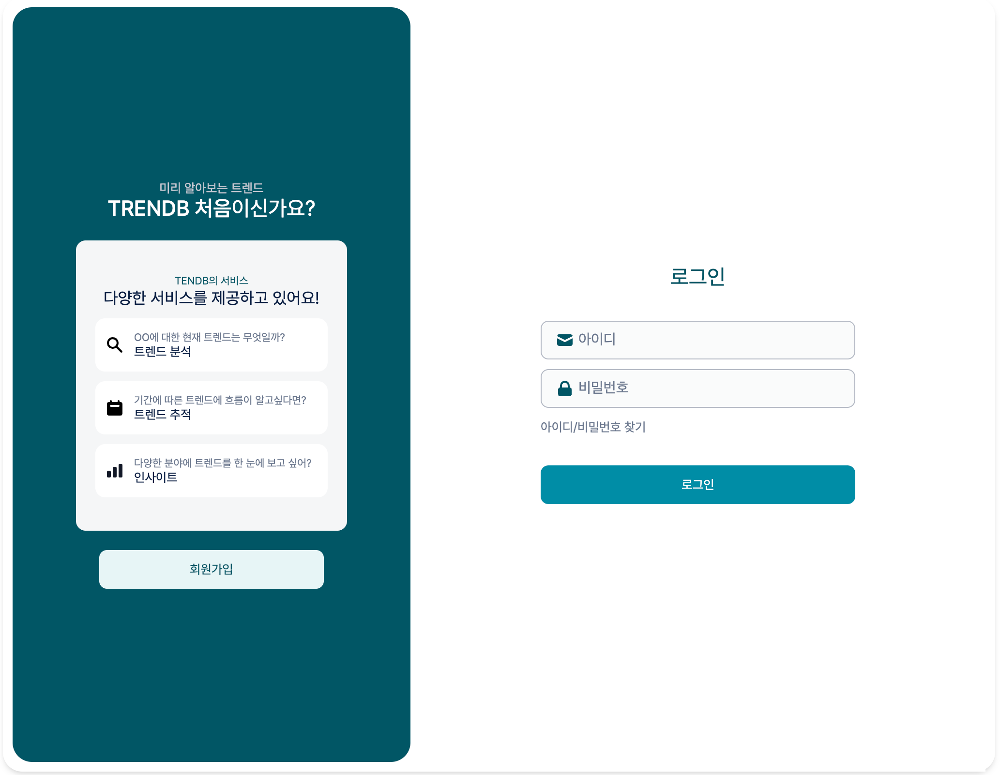
    </td>
    <td align="center" width="50%">
      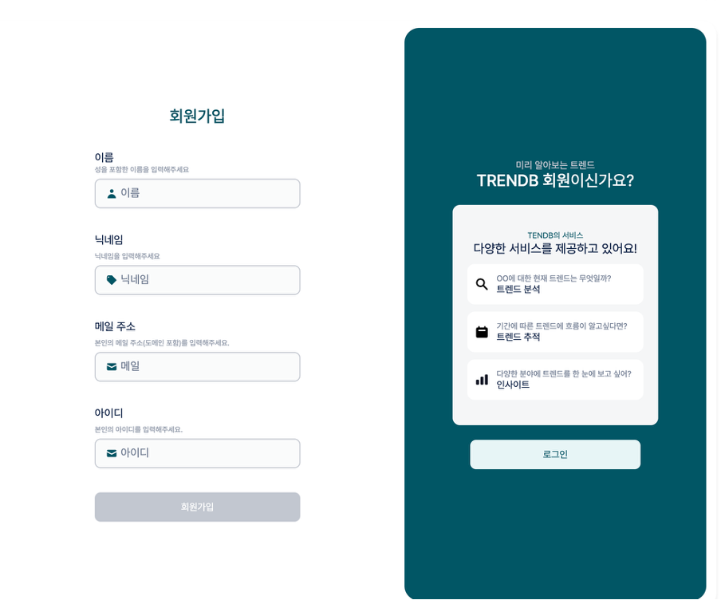
    </td>
  </tr>
  <tr>
    <td align="center"><em>로그인 화면</em></td>
    <td align="center"><em>회원가입 화면</em></td>
  </tr>
</table>

<table align="center">
  <tr>
    <td align="center" width="50%">
      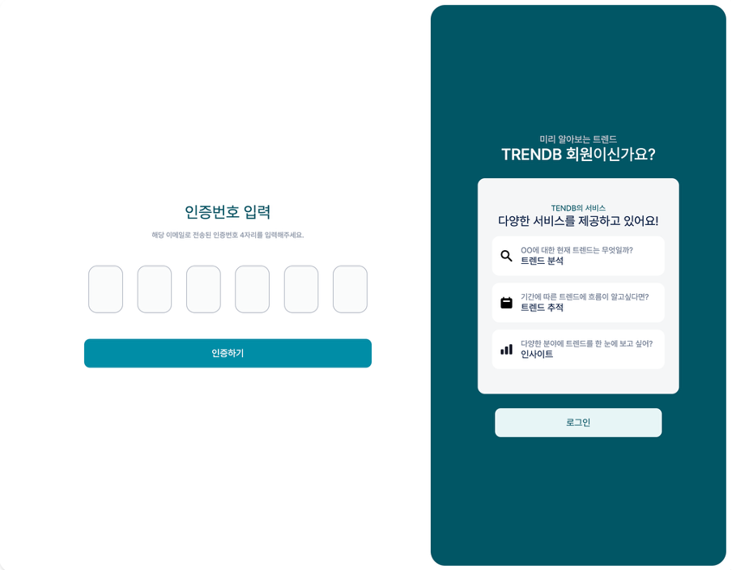
    </td>
    <td align="center" width="50%">
      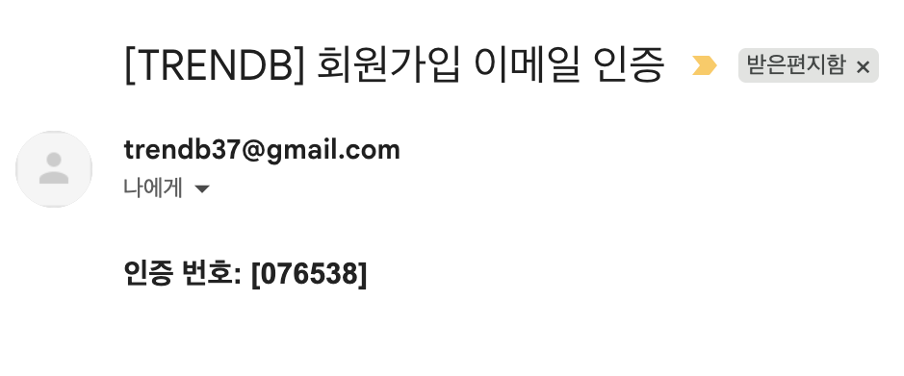
    </td>
  </tr>
  <tr>
    <td align="center"><em>인증번호 입력 화면</em></td>
    <td align="center"><em>회원가입 이메일 인증 발송 예시</em></td>
  </tr>
</table>

### 2.2. AI 챗봇 및 페르소나 기반 대화

- 사용자별 대시보드에서 개인 채팅방과 팀 채팅방을 함께 관리할 수 있습니다.
- 챗봇 질의는 SSE 기반 스트리밍 방식으로 전달되며, Spring 서버가 FastAPI 에이전트 서버의 응답을 프록시합니다.
- 기간별 트렌드 분석, 경쟁사 비교 분석 등 복합 질의에 대해 에이전트 도구 실행 결과를 실시간으로 스트리밍합니다.
- 기본 페르소나와 사용자 정의 페르소나를 함께 관리해 대화 스타일과 시스템 프롬프트를 유연하게 확장할 수 있습니다.
- 답변과 함께 출처를 제공해 사용자가 결과의 근거를 바로 검증할 수 있도록 했습니다.

<p align="center">
  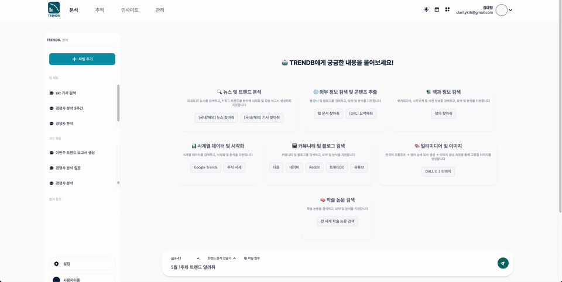
  <br>
  <em>기간별 트렌드 분석 스트리밍</em>
</p>

<p align="center">
  
  <br>
  <em>경쟁사 분석 스트리밍</em>
</p>

<table align="center">
  <tr>
    <td align="center" width="50%">
      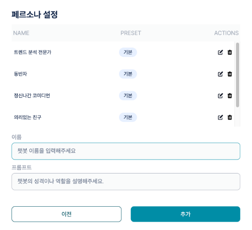
    </td>
    <td align="center" width="50%">
      
    </td>
  </tr>
  <tr>
    <td align="center"><em>페르소나 관리</em></td>
    <td align="center"><em>답변 출처 제공</em></td>
  </tr>
</table>

### 2.3. 인사이트 대시보드 및 뉴스 분석 API

- 특정 날짜 기준의 국내외 종합 인사이트 데이터를 제공합니다.
- 주간 인기 키워드, 연관 검색어, 카테고리별 기사 탐색, 감성 분석 API를 제공합니다.
- Elasticsearch와 PostgreSQL에 적재된 뉴스 분석 데이터를 기반으로 시각화용 데이터를 프론트엔드에 제공합니다.

<p align="center">
  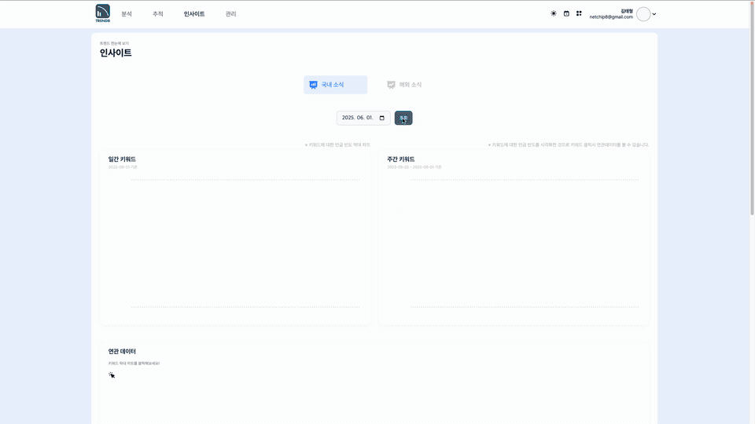
  <br>
  <em>인사이트 트렌드 키워드 탐색</em>
</p>

<table align="center">
  <tr>
    <td align="center" width="50%">
      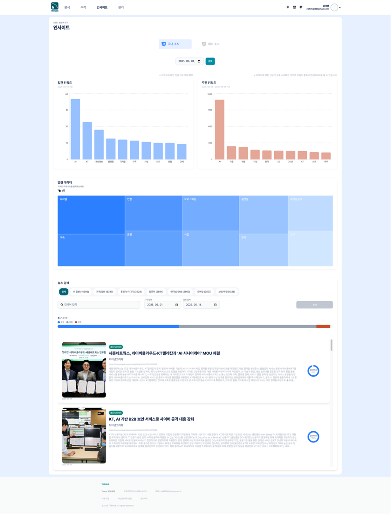
    </td>
    <td align="center" width="50%">
      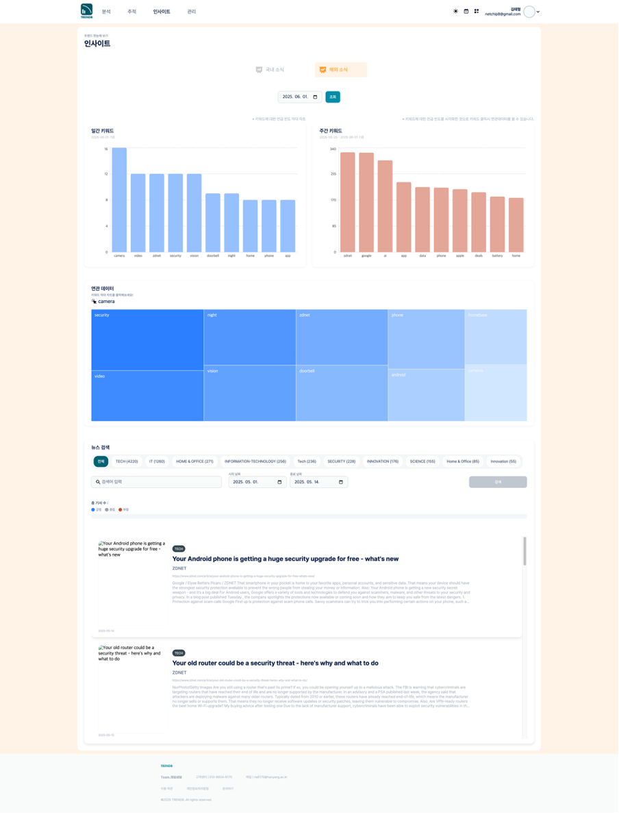
    </td>
  </tr>
  <tr>
    <td align="center"><em>국내 인사이트 대시보드</em></td>
    <td align="center"><em>해외 인사이트 대시보드</em></td>
  </tr>
</table>

### 2.4. 팀 협업 및 문서 공유

- 팀 생성, 수정, 삭제와 팀 멤버 초대 및 역할 변경 기능을 제공합니다.
- 팀 폴더 구조를 만들고 문서를 업로드하면 S3에 원본 파일을 저장하고 DB에 메타데이터를 관리합니다.
- 업로드된 파일은 외부 AI 서버와 연계되어 문서 기반 질의응답(RAG)에 활용됩니다.
- 추천 파일, 파일명 검색, 남은 스토리지 조회, 파일 다운로드/삭제 기능까지 포함해 협업형 문서 저장소 경험을 제공합니다.

<table align="center">
  <tr>
    <td align="center" width="50%">
      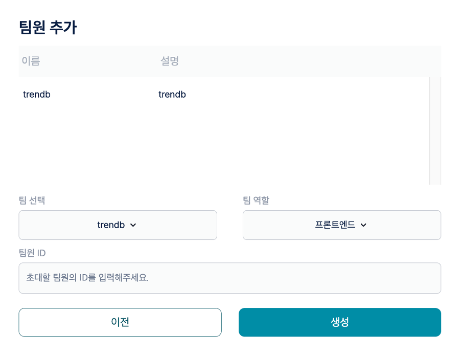
    </td>
    <td align="center" width="50%">
      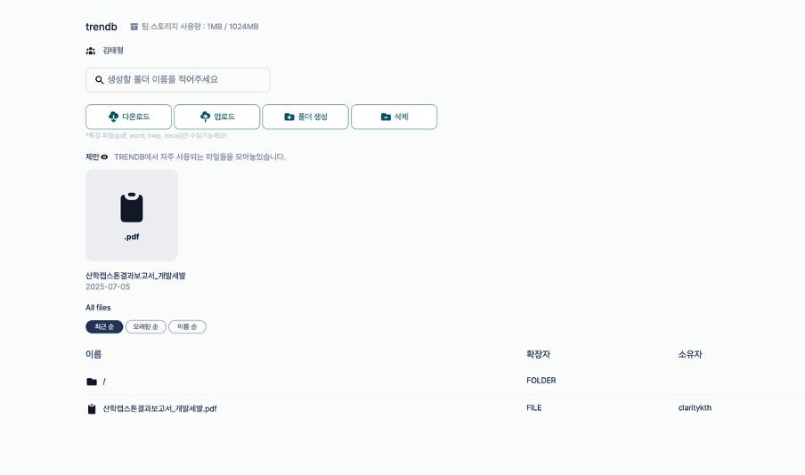
    </td>
  </tr>
  <tr>
    <td align="center"><em>팀원 추가 화면</em></td>
    <td align="center"><em>팀 스토리지 화면</em></td>
  </tr>
</table>

---

## 3. 기술 스택

| 구분 | 기술 | 상세 설명 |
|---|---|---|
| **Backend** | `Java 17`, `Spring Boot 3.3.4`, `Spring Web`, `Spring WebFlux` | REST API 제공, 외부 AI 서버와의 비동기 통신 |
| **Security** | `Spring Security`, `JWT`, `BCrypt` | 토큰 기반 인증 및 사용자 권한 관리 |
| **Database** | `PostgreSQL`, `Spring Data JPA` | 사용자, 팀, 채팅, 파일 메타데이터 등 핵심 서비스 데이터 관리 |
| **Search & Cache** | `Elasticsearch`, `Redis` | 뉴스 검색 및 집계, 캐시 처리 |
| **Storage** | `Amazon S3` | 팀 파일 원본 저장소 |
| **Docs & Monitoring** | `Swagger(OpenAPI)`, `Spring Boot Actuator` | API 문서화 및 애플리케이션 상태 확인 |
| **AI Integration** | `FastAPI`, `Milvus` | AI 에이전트 연동, 스트리밍 응답 프록시, 문서 임베딩 검색 연계 |
| **Communication** | `SMTP` | 회원가입 이메일 인증 및 비밀번호 재설정 메일 발송 |

---

## 4. 관련 저장소

TRENDB는 역할별로 분리된 저장소들이 함께 동작하는 구조입니다.

- **메인 API 서버 (Spring Boot)**: 현재 저장소. 사용자 인증, 팀/파일 관리, 인사이트 API, AI 서버 연동을 담당합니다.
- **AI 에이전트 서버 (FastAPI)**: [langchain-trend-agent](https://github.com/CAPSTONE-DBFIS/langchain-trend-agent) - LangChain 기반 AI 에이전트와 뉴스/웹/커뮤니티/유튜브 등 도구 실행, 문서 기반 질의응답, 스트리밍 응답 생성을 담당합니다.
- **데이터 수집 파이프라인 (Python Scripts & Jenkins)**: [global-it-news-analysis](https://github.com/CAPSTONE-DBFIS/global-it-news-analysis) - 국내외 IT 뉴스 수집, 키워드/감성 분석, 데이터 적재 자동화를 담당합니다.

---

## 5. 시스템 아키텍처 및 데이터 흐름

<p align="center">
  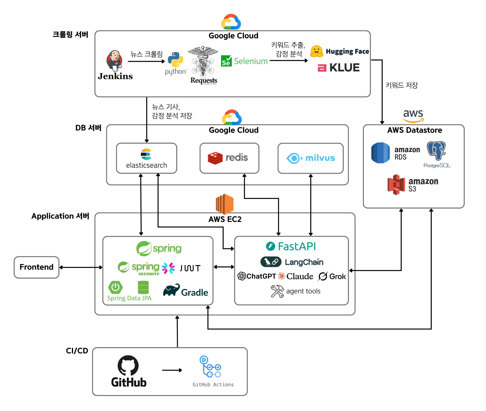
  <br>
  <em>TRENDB 시스템 아키텍처</em>
</p>

<p align="center">
  
  <br>
  <em>AI 에이전트 응답 처리 흐름</em>
</p>

### 요청 처리 흐름

1. 사용자가 웹 화면 또는 클라이언트 앱에서 인증 후 API를 호출합니다.
2. Spring Boot 서버는 JWT를 검증하고 사용자, 팀, 파일 접근 권한을 판별합니다.
3. 일반 비즈니스 요청은 PostgreSQL, Elasticsearch, Redis, S3와 직접 통신해 처리합니다.
4. AI 채팅이나 팀 문서 질의응답 요청은 FastAPI 서버로 전달하고, 응답은 SSE로 다시 스트리밍합니다.
5. 프론트엔드는 이 서버가 제공하는 인사이트 데이터와 협업 기능을 바탕으로 통합 사용자 경험을 구성합니다.

### 데이터 저장 구조

- **PostgreSQL**: 회원, 팀, 채팅방, 메시지, 파일/폴더 메타데이터
- **Elasticsearch**: 뉴스 기사 검색, 키워드 및 감성 분석 기반 조회
- **Redis**: 캐시 및 빠른 접근이 필요한 데이터 저장
- **Amazon S3**: 팀 공유 문서 원본 파일 저장
- **Milvus**: 팀 문서 임베딩 저장 및 RAG 검색

---

## 6. 주요 API 엔드포인트

### 인증 및 사용자

| HTTP Method | 경로 | 설명 |
|---|---|---|
| `POST` | `/api/signup` | 회원가입 및 이메일 인증 발송 |
| `POST` | `/api/login` | 로그인 및 JWT 발급 |
| `POST` | `/api/token` | 액세스 토큰 재발급 |
| `GET` | `/api/mypage` | 내 정보 조회 |
| `PATCH` | `/api/update-profile` | 프로필 수정 |
| `PATCH` | `/api/update-password` | 비밀번호 변경 |

### 챗봇 및 페르소나

| HTTP Method | 경로 | 설명 |
|---|---|---|
| `GET` | `/api/chatbot/dashboard` | 채팅 대시보드 조회 |
| `POST` | `/api/chatbot/chatroom` | 채팅방 생성 |
| `GET` | `/api/chatbot/chatroom/{chatroomId}/messages` | 메시지 조회 |
| `POST` | `/api/chatbot/chatroom/{chatroomId}/agent-query` | AI 에이전트 스트리밍 질의 |
| `GET` | `/api/persona` | 페르소나 목록 조회 |
| `POST` | `/api/persona` | 사용자 페르소나 생성 |

### 팀 및 파일 공유

| HTTP Method | 경로 | 설명 |
|---|---|---|
| `POST` | `/api/teams` | 팀 생성 |
| `GET` | `/api/teams/my-teams` | 내가 속한 팀 목록 조회 |
| `POST` | `/api/teams/{teamId}/members` | 팀 멤버 추가 |
| `POST` | `/api/teams/{teamId}/folders` | 팀 폴더 생성 |
| `POST` | `/api/teams/{teamId}/folders/{folderId}/files` | 파일 업로드 |
| `GET` | `/api/teams/{teamId}/files/{fileId}` | 파일 다운로드 |
| `POST` | `/api/teams/{teamId}/files/query` | 팀 문서 기반 질의응답 |

### 인사이트

| HTTP Method | 경로 | 설명 |
|---|---|---|
| `GET` | `/api/insight` | 날짜 기준 종합 인사이트 조회 |
| `GET` | `/api/insight/weekly` | 주간 인기 키워드 조회 |
| `GET` | `/api/insight/search` | 기간 내 기사 검색 |
| `GET` | `/api/insight/sentiment-analysis` | 키워드 감성 분석 |
| `GET` | `/api/insight/competitors/mentions` | 경쟁사 언급량 분석 |
| `GET` | `/api/insight/competitors/sentiment` | 경쟁사 감성 분석 |

> 전체 API는 Swagger UI에서도 확인할 수 있습니다.

---

## 7. 실행 방법

### 7.1. 사전 요구사항

- `Java 17`
- `Gradle Wrapper`
- `PostgreSQL`
- `Redis`
- `Elasticsearch`
- `AWS S3 접근 정보`
- `FastAPI 에이전트 서버`

### 7.2. 설정

실행 전 `src/main/resources/application.yml` 또는 배포 환경 설정에서 아래 항목들을 환경에 맞게 구성해야 합니다.

| 항목 | 예시 키 |
|---|---|
| 데이터베이스 | `spring.datasource.url`, `spring.datasource.username`, `spring.datasource.password` |
| 메일 인증 | `spring.mail.host`, `spring.mail.username`, `spring.mail.password` |
| JWT | `jwt.issuer`, `jwt.secret` |
| AI 서버 연동 | `fastapi.url` |
| 검색/캐시 | `spring.elasticsearch.uris`, `spring.redis.host`, `spring.redis.password` |
| 파일 저장소 | `aws.access.key`, `aws.secret.key`, `aws.region`, `aws.s3.bucket` |

### 7.3. 로컬 실행

```bash
./gradlew bootRun
```

애플리케이션 실행 후 기본 접근 경로는 다음과 같습니다.

- 홈: `http://localhost:8080/`
- Swagger UI: `http://localhost:8080/swagger-ui.html`
- Actuator: `http://localhost:8080/actuator`

---

## 8. 브랜치 전략

- **`main`**: 안정화된 운영 버전 관리 브랜치
- **`develop`**: 다음 배포 버전을 통합 개발하는 브랜치
- **`feature/*`**: 기능 단위 개발 브랜치
